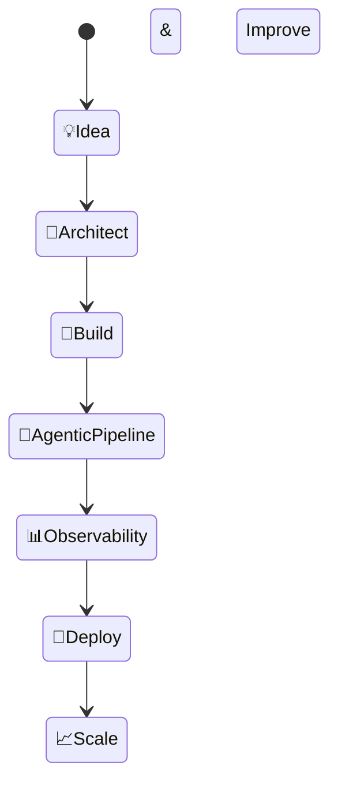

# Hi there 👋, I'm **Divyanshu Yadav** ([@divyanshu1810](https://github.com/divyanshu1810))

## 🚀 About Me

I'm a Specialist Programmer at Infosys building agentic AI systems — turning complex ideas into production-grade, multi-agent pipelines. I specialize in LLM orchestration, distributed backends, and full-stack AI products from 0 → 1.

**🛠️ Tech Stack Highlights:**
- **AI/Agentic**: LangGraph, LangChain, Google ADK, MCP, A2A Protocol, LangFuse, LLM Guard, RAG, FAISS, ChromaDB
- **Backend**: FastAPI, Spring Boot, Express.js, GraphQL, Kafka, microservices
- **Frontend**: React.js, Next.js, React Native
- **Cloud & Databases**: AWS (Bedrock, Lambda, S3, Cognito, CDK, SQS, SNS, EventBridge), PostgreSQL, Aurora, MongoDB, DynamoDB, Redis, Firebase
- **Languages**: Java, Python, TypeScript, JavaScript

**💡 Specialties**:
- Designing multi-agent agentic AI systems with LangGraph + Google ADK
- Integrating MCP servers and A2A Protocol for tool gating and agent communication
- Building RAG pipelines with FAISS, adaptive retrieval, and self-reflective agents
- LLM observability and tracing with LangFuse
- Scalable microservices on AWS with serverless-first architecture
- End-to-end AI product development — from OCR ingestion to Streamlit dashboards

**⚽ Outside of Coding**: Football, Cricket, and F1 fan 🏎️ | Technical Blogger on Medium | 4x Hackathon Winner

---

## 📊 GitHub Stats

  
Click to expand my GitHub stats

  
  
   
  

---

## 📈 Contribution Graph

---

## ✨ Technologies I Work With

| AI/Agentic | Backend | Cloud & DB | Frontend |
|------------|---------|------------|----------|
| LangGraph, LangChain, Google ADK | FastAPI, Spring Boot, Express.js, GraphQL | AWS (Bedrock, Lambda, S3, CDK, SQS) | React.js, Next.js, React Native |
| MCP, A2A Protocol, LangFuse | Kafka, Microservices, Docker | PostgreSQL, Aurora, MongoDB, DynamoDB | TypeScript, Tailwind CSS |
| RAG, FAISS, ChromaDB, LLM Guard | Tesseract OCR, LiteLLM | Redis, Firebase, Supabase | Zustand, Redux |

---

## 🏆 Highlights

- 🥇 Winner — Standard Chartered Hackathon 2024
- 🥇 Winner — Codefest Hackathon 2024
- 📝 Technical Blogger on Medium (RAG, HTTP, agentic systems)
- 💻 500+ LeetCode | 1,000+ competitive programming problems
- 🎓 CGPA 9.61 / 10.0 — SRM IST

---

## 🛠️ How I Build an AI Product from 0 → 1

